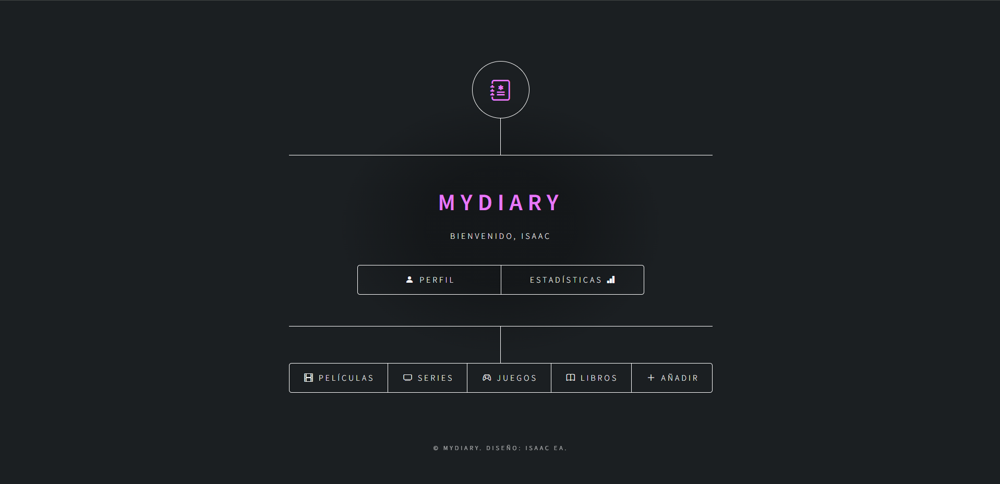
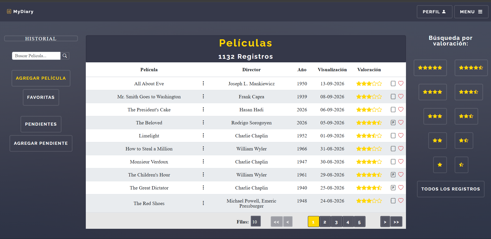
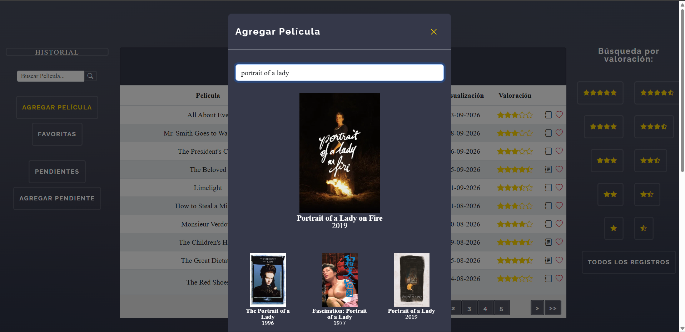
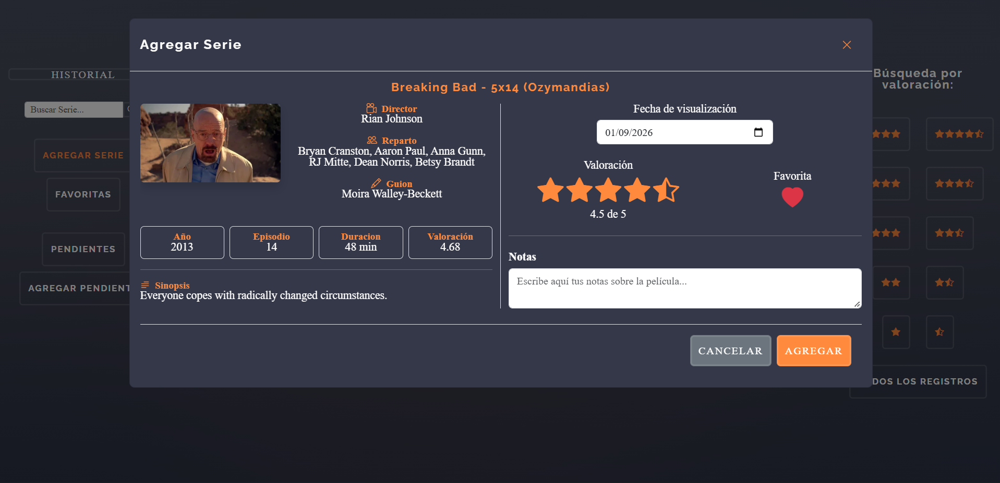
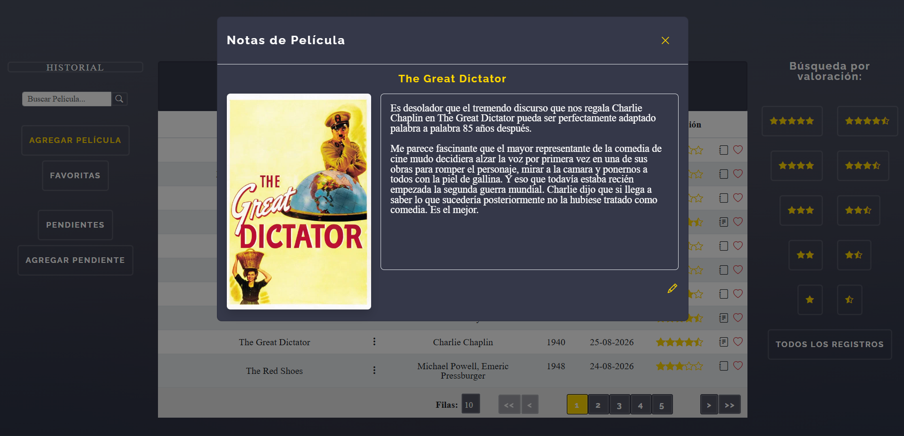

MyDiary es una aplicación web personal para gestionar y organizar diferentes tipos de contenido multimedia, como películas, series (temporadas y episodios), videojuegos y libros.

## Capturas de pantalla







## Funcionalidades
1. Registro de usuario e inicio de sesión personal.
2. Avatar de usuario y posibilidad de editarlo con una imagen local.
3. Cerrar sesión de usuario.
4. Buscar cualquier contenido existente, mostrando los resultados que mejor se ajusten a la búsqueda.
5. Agregar contenido como consumido, pudiendo añadir fecha, valoración en formato de estrellas, favorito y nota personal.
6. Agregar contenido como pendiente, separado del contenido consumido.
7. Agregar contenido pendiente como consumido, sin tener que buscarlo de nuevo.
8. Filtrar por valoración.
9. Lista de contenidos favoritos.
10. Búsqueda de cualquier contenido consumido personal.
11. Información sobre el contenido consumido o pendiente.
12. Editar valoración de contenido consumido.
13. Editar fecha de contenido consumido.
14. Editar nota de contenido consumido.
15. Editar estado de favorito de contenido consumido.
16. Eliminar contenido consumido o pendiente.
17. Historial automático de cualquier acción.
18. Búsqueda adaptada para buscar temporada o episodio concreto desde la serie completa.
19. Agregar serie, temporada o episodio por separado.
20. Agregar y editar estado (Terminada, Viendo, Esperando o Abandonada) de la serie, temporada o episodio consumido.
21. Agregar y editar plataforma usada para el videojuego consumido.
22. Agregar y editar fecha de finalización del videojuego o libro consumido.


Para poder buscar cualquier contenido se usan APIs públicas de terceros, como TMDB para películas y series, IGDB para videojuegos y OpenLibrary para libros. La información proporcionada viene de la petición, pero una vez registrado todo se gestiona desde la base de datos local.  
Debido al funcionamiento de OpenLibrary, se ha decidido que las portadas de los libros se descarguen de forma local en el proyecto una vez que sean registrados.

Si importas la base de datos `sql/MyDiary.sql`, la cual contiene datos de ejemplo, el usuario es "isaac" y la contraseña es "1234".

## Configuración

1. Instalar un entorno de desarrollo local compatible con PHP que incluya Apache, como Laragon o XAMPP.
2. Importar `sql/schema.sql` a cualquier gestor de base de datos, como phpMyAdmin. También puedes importar `sql/MyDiary.sql`, el cual viene con datos de ejemplo incluidos.
3. Obtener los datos necesarios para usar cada API pública de terceros: token de TMDB, clientId y clientSecret de IGDB y un correo electrónico personal para OpenLibrary.
4. Asegurarse de tener Composer instalado. Desde la carpeta del entorno local, ejecutar `composer require vlucas/phpdotenv` para instalar la dependencia necesaria.
5. Crear un archivo `MyDiary.env` al mismo nivel que `composer.json`, en la carpeta del entorno local, y rellenarlo con los datos sensibles (abajo hay una plantilla)
6. Acceder a MyDiary desde el entorno local.

## Tecnologías utilizadas

- PHP 8.3.30
- MySQL
- PDO
- HTML5
- CSS3
- JavaScript
- jQuery
- AJAX
- Bootstrap
- Bootstrap Icons
- Tabulator
- Composer
- PHP dotenv


## Plantilla para MyDiary.env

```env
bDatosServer=""
bDatos="mydiary"
bDatosUser=""
bDatosPass=""

tokenTMDB=""
clientIdIGDB=""
clientSecretIGDB=""
emailOpenLibrary=""
```

## Datos

Autor: Isaac Espinosa Acevedo.  
Correo electrónico: isaacespi96@gmail.com  

Este proyecto es de uso personal y educativo. Todos los derechos reservados.  